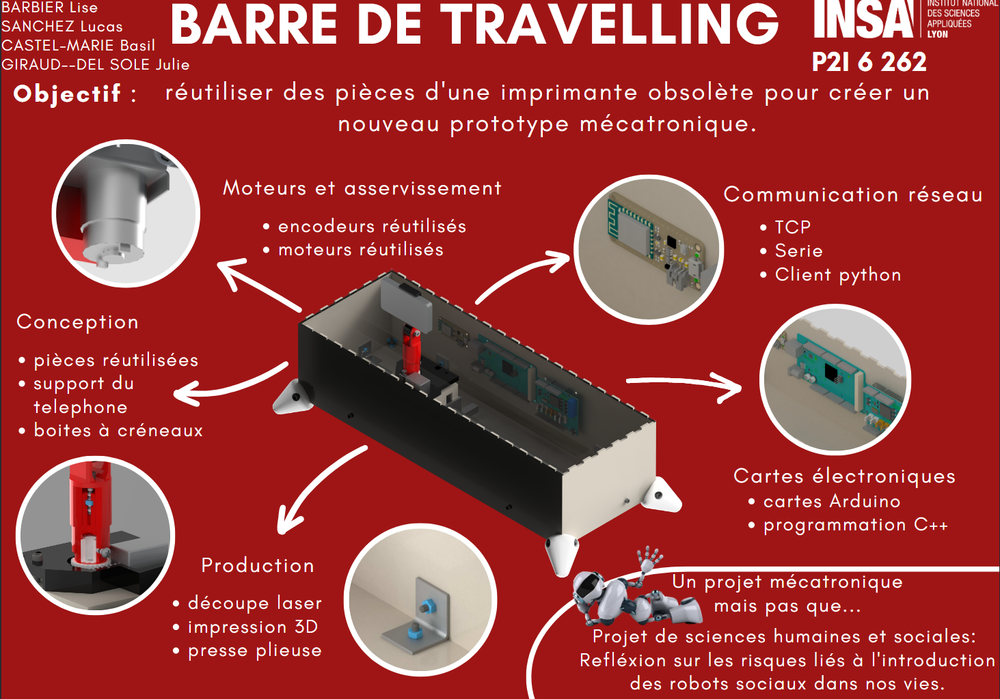
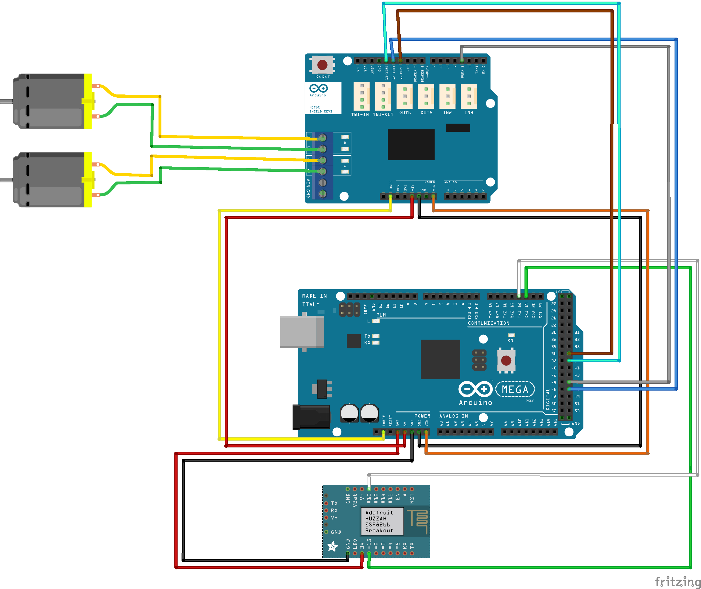

# 📷 Traveling Camera Bar Project -- Arduino & Python Control System (P2I-6)

This project implements a **motorized traveling bar** for camera motion,
controlled through a Python desktop interface.\
It combines an **Arduino Mega**, an **ESP8266 Feather Huzzah**, and a
**Python Tkinter GUI** to provide real-time control, video streaming,
object tracking, media recording, and automated timelapse scenarios.



------------------------------------------------------------------------

## 🚀 Overview

The system allows precise **linear translation** and **rotation** of a
camera using two motors.\
A Python GUI connects to the ESP8266 over TCP and provides:

-   Manual control (translation & rotation)\
-   Real-time video display from an IP webcam\
-   Calibration of the linear rail\
-   Object detection & tracking (OpenCV HSV filtering)\
-   Photo & video recording\
-   Timelapse scenario automation\
-   Live feedback of motor positions from the Arduino Mega

Communication chain:

    PC (Python GUI) ⇄ TCP ⇄ ESP8266 (Wi-Fi) ⇄ Serial ⇄ Arduino Mega 2560

------------------------------------------------------------------------

# 🧠 System Architecture

## 1. Python Application (`Client.py`)

The Python program provides the full control interface.

### 🖥 `App` Class

Handles:

-   GUI (Tkinter)
-   TCP connection to ESP8266
-   Real-time video display (OpenCV)
-   Motor control buttons
-   Scenario builder (timelapse & video)
-   Threaded message reception from ESP8266
-   Object detection & tracking
-   Media recording (photos/videos)

Commands sent to the ESP8266 all begin with a structured header, for
example:

    /MEGA /MOTORA <speed>;
    /MEGA /POS ...
    /MEGA /TL <posA> <posB>;

### 📸 `MyCamera` Class

Responsible for:

-   Connecting to the IP webcam (iVCam or local webcam)
-   Returning raw frames to the UI
-   Writing video files
-   Saving photos
-   Managing resolution, FPS, and codec (XVID)

------------------------------------------------------------------------

## 2. ESP8266 Program (`Code_ESP.ino`)

The Feather Huzzah acts as a **TCP server**.

Its responsibilities:

-   Connect to a configured Wi-Fi network\
-   Accept incoming TCP connections from the PC\
-   Create a **serial bridge** between Python and the Arduino Mega\
-   Forward commands and feedback in both directions\
-   Identify and forward messages using headers:
    -   `/ORDI` → PC → Mega\
    -   `/MEGA` → Mega → PC

The ESP uses **SoftwareSerial** on pins 13 and 15 because I²C
communication was unreliable.

------------------------------------------------------------------------

## 3. Arduino Mega Program (`Code_MEGA.ino`)

The Mega manages the motors and reads the encoders.

Main features:

### 🧭 Calibration

-   Moves the motor until the mechanical limit is reached\
-   Detects plateau in encoder readings\
-   Sets the encoder value to **0** (translation origin)

### ⚙️ Motor Control

Receives commands such as:

    /MOTORA <speed>;
    /MOTORB <speed>;
    /TL <posA> <posB>;

Then:

-   Converts centimeters to encoder units\
-   Ensures setpoints remain in safe range\
-   Applies **P-control** (future upgrade to PI-control)\
-   Sends back motor position every 2 seconds using:

```
    /POSA <value>
    /POSB <value>
```
    

------------------------------------------------------------------------

# 📡 Communication Protocols

### **1. TCP (PC ↔ ESP8266)**

-   PC is the client\
-   ESP8266 is the server\
-   Allows command transmission & status feedback

### **2. Serial (ESP8266 ↔ Arduino Mega)**

-   Implemented via SoftwareSerial\
-   Required because I²C was unreliable\
-   Header-based routing

Example:

    /ORDI /MOTORA 120;

### **3. IP Webcam (PC ↔ Smartphone)**

The Python app retrieves the video stream using OpenCV from iVCam.

------------------------------------------------------------------------

# 🕹 Python GUI Features

### ✔ Manual Control

-   Translate left/right\
-   Rotate left/right\
-   Adjustable motor speed\
-   Progressive acceleration & deceleration for smooth motion

### ✔ Calibration

-   Automatic zeroing of the translation axis

### ✔ Real-Time Video + Object Tracking

-   HSV-based color detection\
-   On-frame markers\
-   Automatic correction commands sent every 300 ms

### ✔ Timelapse Generator

-   Define duration\
-   Select total rotation\
-   Set time interval between photos\
-   Automated movement + shooting\
-   Progress bar showing carriage movement

### ✔ Media Recording

-   Take photos (JPG)\
-   Start/stop video recording (AVI)

------------------------------------------------------------------------

# 📁 Project Structure

    /Client.py        → Python GUI
    /Code_MEGA.ino    → Arduino Mega firmware
    /Code_ESP.ino     → ESP8266 firmware

------------------------------------------------------------------------

# 🛠 Hardware Requirements

-   Arduino Mega 2560\
-   ESP8266 Feather Huzzah\
-   2× DC motors with motor drivers\
-   Linear rail + rotary stage\
-   Encoders\
-   Smartphone (iVCam) or USB webcam\
-   Computer with Python 3

------------------------------------------------------------------------

# 🧩 Software Requirements

### **Python**

-   Python 3.8+
-   Tkinter
-   OpenCV
-   Numpy
-   PIL (Pillow)

### **Arduino**

-   SoftwareSerial\
-   Encoder library\
-   WiFi libraries for ESP8266

------------------------------------------------------------------------

# ▶ How to Run

### **1. Flash the boards**

Upload: - `Code_MEGA.ino` to the Arduino Mega\
- `Code_ESP.ino` to the ESP8266

### **2. Connect devices to the same Wi-Fi network**

(iVCam phone + PC + ESP8266)

### **3. Run the Python app**

``` bash
python Client.py
```

### **4. Enter the ESP8266 IP address in the GUI**

Click **Connect**.

### **5. Start moving the camera!**

------------------------------------------------------------------------

# 📸 Media & Documentation

## 🔌 Wiring Diagram



## 🎬 Demonstration Video


------------------------------------------------------------------------

# 🛠 Future Improvements

-   Upgrade P-control to PI-control\
-   Better object-tracking using ML models\
-   Stabilization algorithms\
-   Automatic timelapse video generation\
-   GUI redesign with PyQt or custom widgets

------------------------------------------------------------------------

# 🙌 Contributors

Lise Barbier, Basile Castel-Marie, Julie Giraud--Del Sol & Lucas Sanchez.
